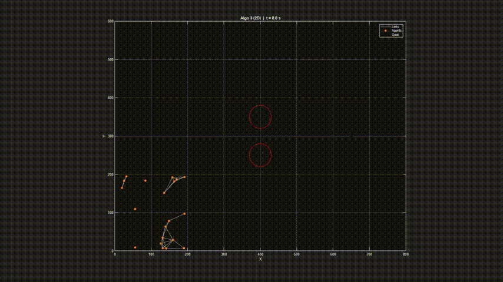

# Flocking (Olfati-Saber + Boids)

MATLAB implementation of flocking for multi-agent systems, including all of Olfati-Saber’s algorithms (1-3) and Boids Flocking.

**Dependencies:**

1. MATLAB (base)
2. [**MVector**](https://github.com/BanaanKiamanesh/MVector) (only for Boids)

> Simulation is tested on swarms of various size. If it takes time don't lose your patience, just wait!

<!-- Gif File of it -->

**References (IEEE):**
[1] R. Olfati-Saber, “Flocking for multi-agent dynamic systems: Algorithms and theory,” *IEEE Transactions on Automatic Control*, vol. 51, no. 3, pp. 401–420, Mar. 2006.
[2] C. W. Reynolds, “Flocks, herds, and schools: A distributed behavioral model,” in *Proc. SIGGRAPH ’87*, 1987, pp. 25–34.
